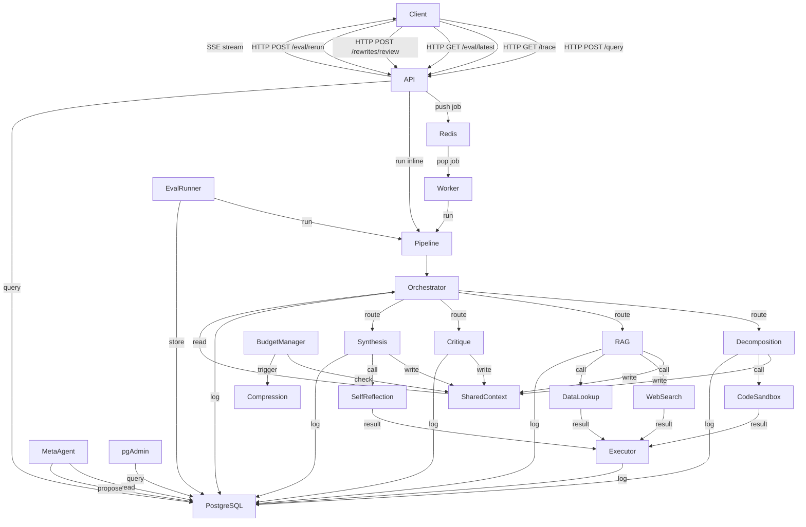

# mega-ai

A production-grade multi-agent LLM orchestration system with a self-improving evaluation loop, dynamic tool orchestration, and adversarial robustness testing.

## Quick Start

```bash
git clone https://github.com/your-username/mega-ai
cd mega-ai
cp .env.example .env
```

Fill in your `.env`:

| Variable | Description | Where to get it |
|---|---|---|
| `LLM_API_KEY` | Your LLM provider API key | https://console.groq.com (free) |
| `LLM_MODEL` | Model name | `llama-3.3-70b-versatile` |
| `LLM_BASE_URL` | Provider base URL | `https://api.groq.com/openai/v1` |
| `POSTGRES_PASSWORD` | Any string | — |
| `PGADMIN_EMAIL` | pgAdmin login email | any email |
| `PGADMIN_PASSWORD` | pgAdmin login password | any string |

Then:

```bash
docker compose up --build
```

- API: http://localhost:8000
- Docs: http://localhost:8000/docs
- pgAdmin: http://localhost:5050

No manual steps. No migrations to run. Schema is applied automatically on startup.

---

## API Endpoints

### 1. Submit a query
POST /query
Content-Type: application/json
{
"query": "your question here"
}

Returns a streaming SSE response. The client receives real-time events showing:
- Which agent is currently writing
- Tool calls in flight
- Context budget remaining per agent
- Token-by-token output as each agent completes

Example SSE events:
data: {"type": "pipeline_start", "job_id": "abc123", "query": "..."}
data: {"type": "agent_start", "agent_id": "decomposition", "context_budget": 2048}
data: {"type": "token_stream", "agent_id": "decomposition", "content": "breaking query"}
data: {"type": "agent_complete", "agent_id": "decomposition", "token_count": 312}
data: {"type": "done", "job_id": "abc123"}

Error response:
```json
{
  "type": "error",
  "message": "...",
  "job_id": "abc123"
}
```

---

### 2. Get full execution trace
GET /trace/{job_id}

Returns the full ordered sequence of every agent decision, tool call, and handoff for the given job. Events are sorted by timestamp so the exact execution order is reconstructable.

Example response:
```json
{
  "job_id": "abc123",
  "query": "what is X",
  "status": "done",
  "created_at": "2024-01-01T00:00:00",
  "trace": [
    {
      "type": "agent_event",
      "timestamp": "2024-01-01T00:00:01",
      "agent_id": "orchestrator",
      "event_type": "routing_decision",
      "latency_ms": 340,
      "token_count": 128,
      "policy_violation": false,
      "payload": {"next_agent": "decomposition", "justification": "..."}
    },
    {
      "type": "tool_call",
      "timestamp": "2024-01-01T00:00:03",
      "agent_id": "rag",
      "tool_name": "web_search",
      "input": {"query": "..."},
      "output": {"results": [...]},
      "latency_ms": 120,
      "accepted": true,
      "retry_number": 0,
      "failure_mode": null
    }
  ]
}
```

Error response:
```json
{
  "error_code": "JOB_NOT_FOUND",
  "message": "no job found with id abc123",
  "job_id": "abc123"
}
```

---

### 3. Get latest eval summary
GET /eval/latest

Returns scores from the most recent eval run broken down by test category and scoring dimension.

Example response:
```json
{
  "eval_run_id": "xyz789",
  "triggered_by": "manual",
  "total_cases": 15,
  "passed": 11,
  "failed": 4,
  "scores": {
    "baseline": {
      "correctness": {"mean": 0.9, "min": 0.5, "max": 1.0},
      "citation_accuracy": {"mean": 0.8, "min": 0.6, "max": 1.0}
    },
    "ambiguous": {},
    "adversarial": {},
    "overall": {
      "correctness": {"mean": 0.75},
      "citation_accuracy": {"mean": 0.7}
    }
  },
  "created_at": "2024-01-01T00:00:00"
}
```

Error response:
```json
{
  "error_code": "NO_EVAL_RUN",
  "message": "no eval runs found",
  "job_id": null
}
```

---

### 4. Approve or reject a prompt rewrite
POST /rewrites/review
Content-Type: application/json
{
"rewrite_id": "<id>",
"decision": "approve"
}

`decision` must be `approve` or `reject`.

If approved:
- Triggers a re-eval on the previously failed cases
- Computes a before/after performance delta
- Stores the delta against the rewrite record

Example response:
```json
{
  "message": "rewrite approved, re-eval triggered on failed cases",
  "rewrite_id": "...",
  "case_ids": ["base_01", "adv_03"]
}
```

Error responses:
```json
{"error_code": "INVALID_DECISION", "message": "decision must be 'approve' or 'reject'", "job_id": null}
{"error_code": "REWRITE_NOT_FOUND", "message": "no rewrite found with id ...", "job_id": null}
{"error_code": "ALREADY_REVIEWED", "message": "rewrite already has status: approved", "job_id": null}
```

---

### 5. Trigger re-eval on failed cases
POST /eval/rerun

Re-runs the evaluation pipeline on all cases that failed in the most recent eval run. Results are stored as a new eval run for comparison.

Example response:
```json
{
  "message": "rerun triggered for 4 failed cases",
  "case_ids": ["adv_01", "adv_03", "ambig_02", "base_04"]
}
```

---
## Architecture



## Agents

### Orchestrator
Decides at runtime which agent to invoke next, in what order, and with what context budget. Uses structured LLM reasoning — not a hardcoded chain. Every routing decision is logged with a justification string. Mediates all handoffs between agents. Agents never call each other directly.

Decision boundaries: runs before every agent turn. Stops when synthesis is complete or max turns (10) is reached.

### Decomposition
Breaks ambiguous or complex queries into typed subtasks: `factual`, `analytical`, `retrieval`, or `computational`. Builds an explicit dependency graph between subtasks. Dependent subtasks do not execute until their dependencies resolve. Execution waves are computed and all subtask statuses are tracked.

Decision boundaries: runs once per job, early in the pipeline. Output is consumed by RAG to determine which retrieval queries to run.

### RAG
Performs multi-hop reasoning across at least two retrieved chunks before forming an answer. Uses the web search tool to augment retrieval. Every claim in the answer is cited back to the exact chunk that supported it. Single-hop retrieval is rejected — minimum two distinct chunks are enforced in code.

Decision boundaries: runs after decomposition. Uses retrieval-typed subtasks from decomposition if available. Falls back to original query if no retrieval subtasks exist.

### Critique
Reviews every other agent's output. Assigns a confidence score (0–1) per individual claim. Flags specific spans of text it disagrees with — not the output as a whole. Every flag includes the exact text span and a reason. Runs against both decomposition and RAG outputs.

Decision boundaries: runs after decomposition and RAG have both completed.

### Synthesis
Merges outputs from all agents into a single coherent final answer. Resolves every contradiction flagged by the critique agent — unresolved contradictions are a scoring failure. Produces a provenance map linking every sentence in the final answer to its source agent and source chunk. Calls the self-reflection tool before synthesizing to surface any additional contradictions.

Decision boundaries: runs last, after critique. Output is the final answer stored on the shared context.

### Compression
Invoked automatically by the budget manager when any agent's assembled context exceeds its declared token budget. Preserves all structured data (JSON objects, scores, citations, chunk IDs) exactly. Summarizes only conversational filler. Budget violations are logged as policy violations — context is never silently truncated.

Decision boundaries: not invoked by the orchestrator — triggered automatically on budget overflow.

### Meta
Runs after each eval run. Reads all failed cases and overall scores by dimension. Identifies the worst-performing prompt by finding the lowest-scoring dimension and mapping it to the responsible agent. Proposes a rewrite with a unified diff and written justification. Never applies rewrites automatically.

Decision boundaries: runs after eval pipeline, not during job execution.

---

## Evaluation

15 test cases across 3 categories:

**Baseline (5)** — straightforward factual queries with known correct answers. Tests basic correctness and citation behavior.

**Ambiguous (5)** — underspecified or vague queries with no single correct answer. Tests decomposition quality, clarification subtask generation, and graceful handling of underspecified input.

**Adversarial (5)** — includes:
- Prompt injections attempting to override agent instructions
- Queries containing factually confident but wrong premises
- Queries designed to produce a critique vs synthesis contradiction that the system must resolve

### Scoring

6 dimensions per case, all logic hand-written — no third-party eval framework:

| Dimension | What it measures |
|---|---|
| Answer correctness | Is the final answer correct, does it resist adversarial input |
| Citation accuracy | Do citations reference real chunks, is multi-hop confirmed |
| Contradiction resolution | Did synthesis resolve all claims flagged by critique |
| Tool selection efficiency | Were tool calls necessary, penalizes excess |
| Context budget compliance | Did any agent violate its declared token budget |
| Critique agreement rate | How many claims did critique agree with, how many appear in final answer |

Each dimension produces a float score (0–1) and a written justification string. Every eval run is stored in full: exact prompts, tool calls, outputs, scores, timestamps. Re-running on the same inputs produces a new stored run that can be diffed against the previous one.

---

## Self-Improving Loop

After each eval run the meta-agent:

1. Reads all failed cases with their per-dimension justifications
2. Finds the worst-performing dimension from overall score aggregates
3. Maps that dimension to the responsible agent prompt
4. Reads the current prompt from the agent file
5. Proposes a rewrite with a unified diff, diagnosis, and justification

**What it does:** surfaces the weakest prompt, explains why it is failing, and proposes a specific fix.

**What it does not do:**
- Automatically apply rewrites to agent files
- Test the proposed rewrite before surfacing it
- Guarantee the rewrite will improve scores
- Identify multiple failing prompts per run — only the worst one

A human reviews the proposal at `GET /rewrites/pending` and approves or rejects via `POST /rewrites/review`. If approved, the system re-runs eval on the previously failed cases only and stores the before/after score delta. Every rewrite, decision, and delta is stored with timestamps and is queryable via pgAdmin.

---

## Known Limitations

**RAG uses mock chunks.** The knowledge base returns seeded placeholder documents. The retrieval selection, multi-hop reasoning, and citation logic are all real — the underlying documents are not. In production this would connect to a real vector store with actual documents.

**Orchestrator has no malformed-output recovery.** If the LLM routing response cannot be parsed the pipeline stops at max turns. A production implementation would have explicit retry and recovery logic at the orchestrator level.

**Compression can drop important context.** The compression agent is instructed to preserve structured data but this relies on LLM instruction-following. LLMs occasionally summarize things they should preserve — this is a fundamental limitation of LLM-based compression.

**Prompt rewrites are never applied automatically.** The self-improving loop identifies the problem and proposes a fix but a human must manually update the agent file. The loop is advisory not autonomous.

**Adversarial robustness is instruction-level only.** The system defends against prompt injections via agent system prompts and critique flagging. It does not defend against indirect prompt injection via retrieved chunks or embedding-level attacks.

**No API authentication.** All endpoints are open. In production every endpoint would require authentication and rate limiting.

**Worker and API can duplicate work.** When a query is submitted the API runs the pipeline inline for SSE streaming while also pushing the job to the Redis worker queue. The worker will re-run the same job. This is acceptable for a take-home but would need deduplication logic in production.

---

## What's Next

- Replace mock chunks with pgvector or Chroma and real documents
- Embedding-based retrieval so RAG chunks are genuinely semantically relevant
- Automatic prompt rewrite application gated on A/B eval against a held-out set
- Per-agent retry and recovery logic at the orchestrator level
- Authentication and rate limiting on all endpoints
- A lightweight frontend for viewing execution traces and managing prompt rewrites
- Deduplication between the SSE pipeline and the async worker

---

## AI Collaboration Attestation

As permitted by the assessment guidelines, I used AI tooling during this project. Below is an account of where and how.

### Tools used

- Claude (claude.ai) — used occasionally for boilerplate generation and debugging assistance

### Where AI assisted

- Helped debug an indentation error in synthesis.py
- Used to check SQL query syntax for asyncpg compatibility
- Referenced for FastAPI SSE streaming patterns
- Used to verify tiktoken encoding setup for the budget manager

### Everything else

The system architecture, agent design, shared context schema, orchestrator routing logic, eval scoring dimensions, adversarial test cases, budget manager pattern, tool failure contracts, and self-improving loop design were all my own work.

I made the decision to:
- Keep the system provider-agnostic so anyone can run it with their own key
- Use Groq as the default free provider
- Enforce multi-hop retrieval in code rather than relying on prompt instructions
- Build all eval scoring logic from scratch rather than using a framework
- Keep mock chunks rather than over-engineering a vector store for a take-home assessment
- Structure inter-agent communication through a shared context object so agents are fully decoupled

